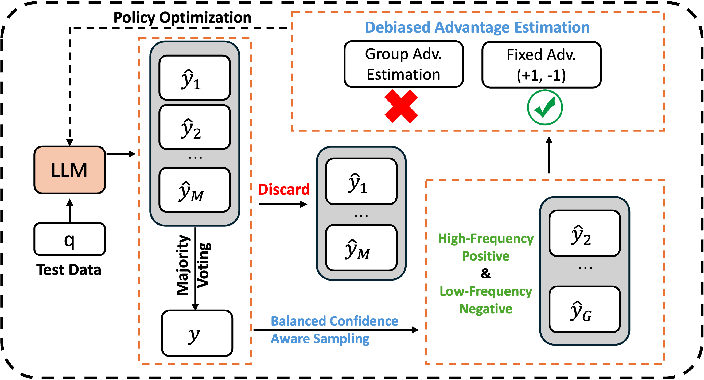

<div align="center">

<h1>Understanding and Mitigating Spurious Signal Amplification in Test-Time Reinforcement Learning for Math Reasoning</h1>

<p>
  Yongcan Yu<sup>1,2</sup>, 
  Lingxiao He<sup>3</sup>, 
  Jian Liang<sup>1,2</sup>, 
  Kuangpu Guo<sup>1,4</sup>, 
  Meng Wang<sup>3</sup>,
  Qianlong Xie<sup>3</sup>,
  Xingxing Wang<sup>3</sup>, 
  Ran He<sup>1,2</sup>
</p>

<p>
  <sup>1</sup>NLPR & MAIS, Institute of Automation, Chinese Academy of Sciences<br>
  <sup>2</sup>School of Artificial Intelligence, University of Chinese Academy of Sciences<br>
  <sup>3</sup>Meituan<br>
  <sup>4</sup>University of Science and Technology of China
</p>

<p>
  <code>yuyongcan0223@gmail.com</code>, <code>liangjian92@gmail.com</code>
</p>

</div>

## 🚀 News
* **[2026/06]** The code of DDRL was released!
* **[2026/04]** DDRL is accepted by ACL 2026 Findings!


## 📖 Overview
We propose DDRL (Debiased and Denoised test-time Reinforcement Learning), a robust test-time reinforcement learning framework designed to mitigate spurious signals from label noise. DDRL first applies a frequency-based sample selection strategy to exclude ambiguous responses while maintaining a balanced set of positive and negative examples. It then introduces debised advantage estimation with fixed advantages, removing biases induced by group-relative policy optimization. Finally, DDRL incorporates a consensus-based off-policy refinement stage, leveraging a rejection-sampled dataset to enable efficient and stable model updates. Extensive experiments on multiple large language models across diverse mathematical reasoning benchmarks demonstrate that DDRL consistently outperforms existing TTRL baselines, achieving reliable improvements in accuracy, stability, and robustness.

<div align="center">
  
</div>

## ⚡️ Getting Started

### Environment Setup

```bash
git clone https://github.com/yuyongcan/DDRL.git

cd DDRL/verl
conda create -n ddrl python==3.10
conda activate ddrl
bash install_deps.sh
pip install -e .
```

### Training
Then run:

```bash
bash examples/ddrl/LLaMA3.1-Instruct/amc.sh
```

### Consensus-based Off-policy Refinement (COR)

The COR stage leverages the rejection-sampled rollout data to perform efficient and stable off-policy SFT. The rollout data generated during training is saved under the `rollout_data_dir` specified in the training script. You can use this data with any third-party SFT framework (e.g., [LLaMA-Factory](https://github.com/hiyouga/LLaMA-Factory)) to fine-tune the model:

1. **Collect rollout data**: After the RL training, the rollout data is stored in `rollout_data_dir`.
2. **Fine-tune with SFT**: Feed the rollout data into a third-party training framework such as [LLaMA-Factory](https://github.com/hiyouga/LLaMA-Factory) to perform the COR stage.

## 🙏 Acknowledgement
This work is based on [TTRL](https://github.com/PRIME-RL/TTRL) and [veRL](https://github.com/verl-project/verl). We sincerely thank the authors and contributors of these excellent open-source projects.

## 📚 Citation
If you find our work helpful, please consider citing:

```bibtex
@article{yu2026understanding,
  title={Understanding and Mitigating Spurious Signal Amplification in Test-Time Reinforcement Learning for Math Reasoning},
  author={Yu, Yongcan and He, Lingxiao and Liang, Jian and Guo, Kuangpu and Wang, Meng and Xie, Qianlong and Wang, Xingxing and He, Ran},
  journal={arXiv preprint arXiv:2604.21327},
  year={2026}
}
```

## 📄 License
This project is licensed under the MIT License.